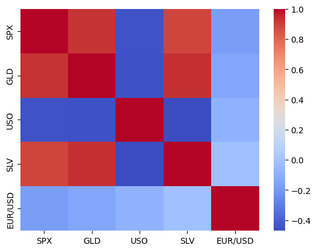

# HW_W2_MKB
# 📈 S&P 500 (SPX) Prediction Analysis

This project explores the relationship between the S&P 500 (SPX) and other financial instruments, specifically gold (GLD) and silver (SLV), using a **linear regression model**.  
The core goal is to evaluate whether the prices of GLD and SLV can help forecast SPX movements.

---

## 📊 Data and Initial Findings

- **Dataset:** `gold_data_2015_25.csv` (daily price data from 2015 to 2025).  
- **Preprocessing:**
  - Converted `Date` column to datetime and set it as the index for time-series analysis.  
  - Verified dataset integrity — no missing values.  

### 🔑 Key Observations
- **SPX & GLD:** Strong positive correlation (~ **0.93**) → they generally move in the same direction.  
- **SPX & SLV:** Strong positive correlation (~ **0.89**).  
- **SPX & USO (oil):** Moderate negative correlation (~ **-0.44**) → when one rises, the other tends to fall.  

---

## 🤖 Prediction Model

- **Model:** Simple Linear Regression  
- **Features:** GLD, SLV  
- **Target:** SPX  

### 📐 Model Performance
- **Mean Absolute Error (MAE):** ~ **$364.94**  
- **Mean Absolute Percentage Error (MAPE):** ~ **11.1%**  

✅ The model captures overall trends in SPX.  
⚠️ However, it struggles with short-term fluctuations (peaks & valleys).

---

## 📉 Results & Visualization

- A line plot of actual vs. predicted SPX confirms that predictions follow the **general trend**, but not the exact magnitude of daily changes.  

---

## 🚀 Next Steps

This project shows promise but highlights the **limitations of simple regression**.  
Future improvements may include:  
- Adding more features (oil, interest rates, volatility index, etc.).  
- Using more advanced models (Random Forest, Gradient Boosting, LSTMs).  
- Incorporating macroeconomic indicators and market sentiment data.  

---

